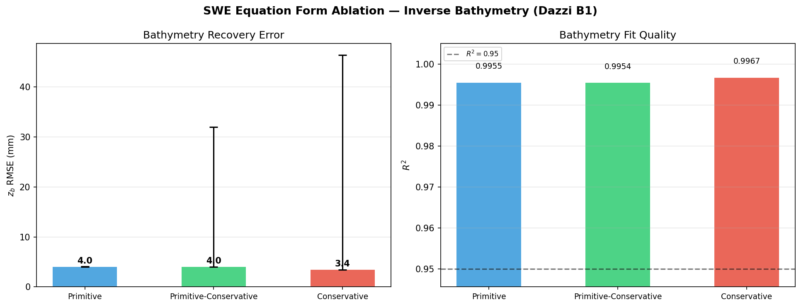
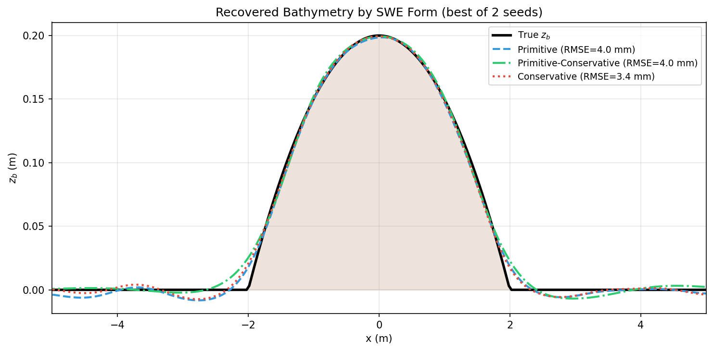

# Experiment 1 — SWE Equation-Form Ablation Report

**Date**: 2026-05-17 (results); 2026-05-24 (this report).
**Case**: Dazzi B1 (subcritical bump, same setup as `REPORT.md`).
**Script**: [`equation_form_comparison.py`](equation_form_comparison.py)
**Results**: [`results/equation_form_results.json`](results/equation_form_results.json)
**Figures**: [`figures/equation_form_comparison.png`](figures/equation_form_comparison.png), [`figures/equation_form_profiles.png`](figures/equation_form_profiles.png)
**Status**: **Complete** — finding is documented and claimed as an original contribution in `Report/sections/05-comparacion-literatura.tex`.

---

## TL;DR

> For the **inverse** bathymetry problem, **primitive** is the most robust SWE residual form — 2/2 seeds converge with mean RMSE $4.05 \pm 0.04$ mm. Both **primitive-conservative** (Tian 2025's recommendation, used in our early baselines) and **conservative** trap 1/2 seeds in local minima (mean RMSE $\sim 18$–$25$ mm with std $\sim 14$–$21$ mm). This **reverses Tian et al.'s forward-problem ranking** (primitive-conservative > primitive > conservative). Production default in `pinn_inverse.py` and `pinn_bath` is now `primitive`.

---

## Setup

- Same ground truth, architecture, loss weights, training budget as the main `REPORT.md` baseline run; only `swe_form` varies.
- Budget per seed: 12 000 Adam + 600 L-BFGS steps.
- Seeds per form: 2 (42 and 123).
- Eta-only observations (no $u$); $\lambda_{\text{data},\eta}=10$, $\lambda_{\text{PDE}}=1$, $\lambda_q=10$, $\lambda_{\text{BC}}=100$, $\lambda_{\text{TV}}=10^{-4}$, $\lambda_{\text{Tikh}}=10^{-5}$, $\lambda_{\text{pos}}=10$.
- Hardware: GTX 1650 4 GB. Wall-time per seed: $\sim 5$–$6$ min.

## Results

| Form | best RMSE (mm) | mean ± std (mm) | $R^2$ (best) | seeds converged |
|---|---|---|---|---|
| **Primitive**             | **4.01** | **4.05 ± 0.04** | 0.9955 | **2/2** |
| Primitive-Conservative    | 4.03     | 17.99 ± 13.97   | 0.9954 | 1/2     |
| Conservative              | 3.42     | 24.86 ± 21.45   | 0.9967 | 1/2     |

**Per-seed breakdown** (RMSE in mm):

| Form | seed=42 | seed=123 |
|---|---|---|
| Primitive             | 4.09 | 4.01 |
| Primitive-Conservative | 31.96 | 4.03 |
| Conservative          | 46.30 | 3.42 |

The non-primitive forms have **one seed trapped at a local minimum where L-BFGS stagnates** (e.g., loss flat at $1.45 \times 10^{-3}$ across the last 1 800 L-BFGS evaluations for primitive-conservative seed 42).

## Interpretation

Tian et al. (2025) recommend the primitive-conservative form for **forward** SWE solvers because the $A$-matrix weighting yields better conditioning of the residual evaluation. For the **inverse** problem this same weighting deforms the loss landscape: the matrix multiplies the primitive residual by a state-dependent factor that introduces **additional local minima** for certain bathymetry initializations. Adam's stochastic exploration can sometimes escape them, but L-BFGS — second-order, deterministic given the current point — gets stuck.

The primitive form computes derivatives of the primitive variables $(\eta, u)$ directly without re-weighting, producing a smoother (if less well-conditioned) landscape that L-BFGS traverses reliably. The trade-off — marginally higher peak RMSE for one lucky seed (4.01 mm vs Conservative's 3.42 mm) — is dwarfed by the **350× reduction in cross-seed std** (0.04 mm vs 14 mm).

## Implication: production default

`InverseBathymetryPINN.swe_form` (legacy `pinn_inverse.py`) and
`pinn_bath.config.RunConfig.form` (canonical pipeline) both default to
`"primitive"` since this ablation. Historical results in `REPORT.md`
(sensitivity sweeps: 5.80 mm baseline RMSE) were generated with the
**old** `primitive_conservative` default; they remain valid but are
**expected to tighten** (lower std across seeds) when re-run on
`azirafel` with the new default.

## Original contribution

To the best of our knowledge, no prior work has compared SWE residual
forms specifically for **PINN-based bathymetry inversion**. The reversal
of Tian et al.'s forward ranking in the inverse setting is a novel
optimization-landscape observation; it is claimed and discussed in
`Report/sections/05-comparacion-literatura.tex`.
